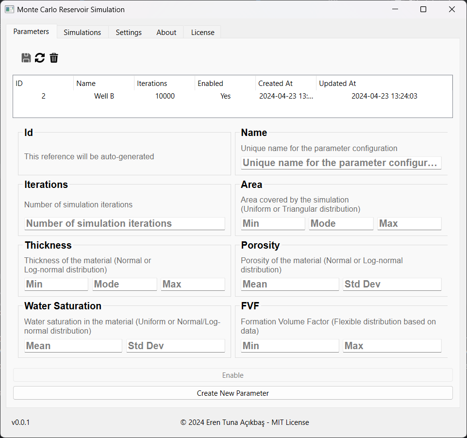
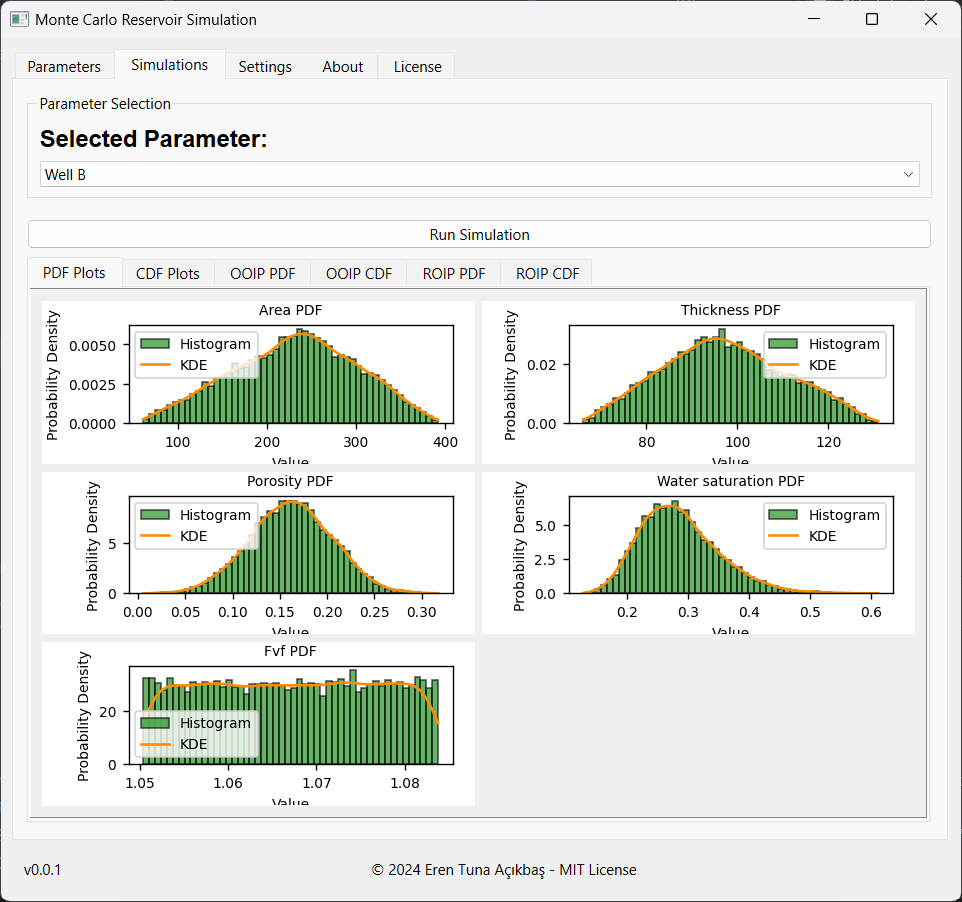
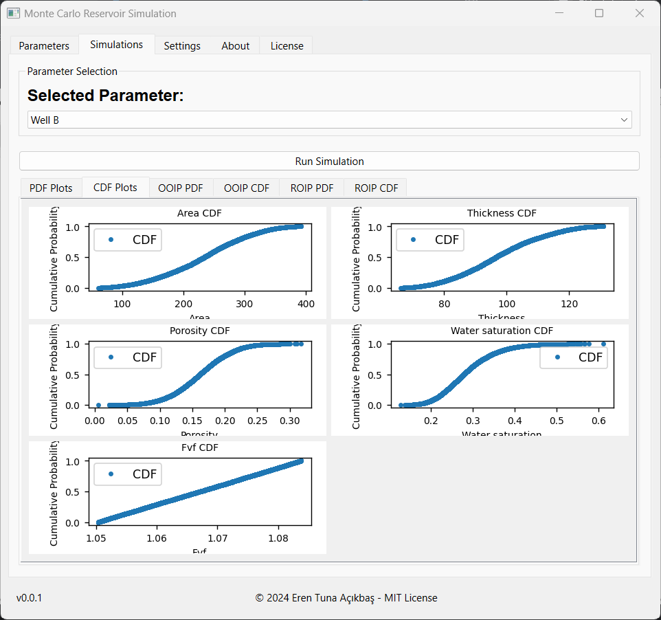
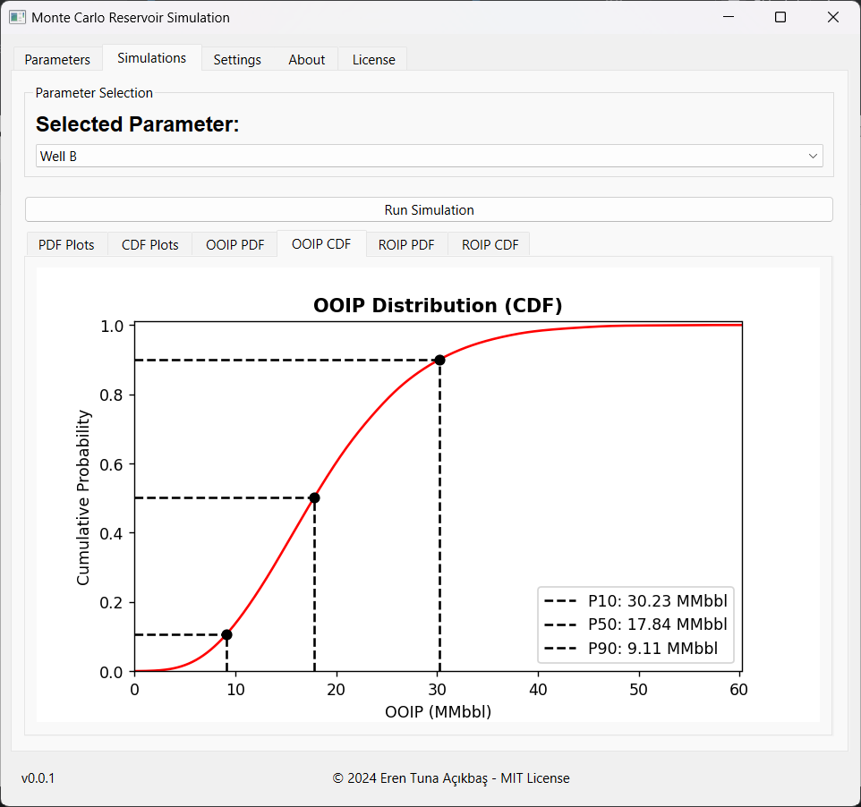

# Monte Carlo Reservoir Simulation

## Project Overview
This project implements a Monte Carlo simulation for estimating the volume of hydrocarbon reservoirs. By leveraging probabilistic methods, it accounts for uncertainties in reservoir parameters to generate a distribution of possible reservoir volumes, aiding in better decision-making and risk assessment in petroleum engineering. This project is created from scratch the PETE 418 Course.

## Features
- Customizable probabilistic distributions for key reservoir parameters (area, thickness, porosity, water saturation, and formation volume factor).
- Execution of numerous simulation iterations to generate a comprehensive distribution of reservoir volumes.
- Statistical analysis of simulation results to identify mean and standard deviation of the estimated volumes.
- Visualization tools to plot the distribution of simulated reservoir volumes.

## Getting Started

### Screenshots

#### Parameters Screen
<p align="center">
  

</p>

#### Simulations Screen
<p align="center">
  
  
  

</p>

### Prerequisites
- Python 3.6 or newer
- numpy
- matplotlib

### Installation
Clone this repository to your local machine using:

Navigate to the project directory:
```sh
cd monte_carlo_reservoir_simulation
```

Create a virtual environment using:
```sh
python -m venv monte_carlo_env
```

Activate the virtual environment using:
```sh
source monte_carlo_env/bin/activate
```

Install the required packages using:
```sh
pip install -r requirements.txt
```

### Usage
Run the main script using:
```sh
python .\app\watchdog.py
```

## Contact
Eren Acikbas - eren@erenacikbas.com
